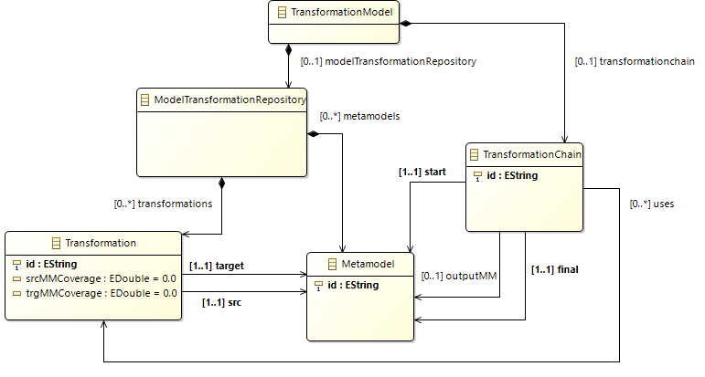

# Selection of Model Transformation Chains with MOMoT

## About

This project contains a toolset supporting the automated multi-objective search for optimal model transformations. It makes use of the MOMoT framework to evolve a problem-representing model using in-place (Henshin) M2M transformations. An exhaustive search is employed to generate all possible model variants in order to evaluate all feasible model transformation chains. The user obtains the Pareto-optimal solutions visually as well as can execute transformation from the source to the target model immediately to achieve the determined quality criteria.

- Ecore models => ./metamodel
- Henshin Rules => ./transformations
- Fitness calculation => ./src/trafochainselection/demo
- Test instances => ./problem

## Setup

Follow the instructions for importing required projects at https://github.com/lowcomote/chain-optimisation.git for the setup.

After importing all projects, set the right target platform.

- Open _releng/org.eclipse.epsilon.target/org.eclipse.epsilon.target.target_ and click "Set as Active Target Platform" on the top right

Run the experimental setup

- The executable setup is configured in _transformationselection/src/trafochainselection/demo/ExhaustiveChainSearch.java_
- The constant _INITIAL_MODEL_ sets the input model for the respective test case.
